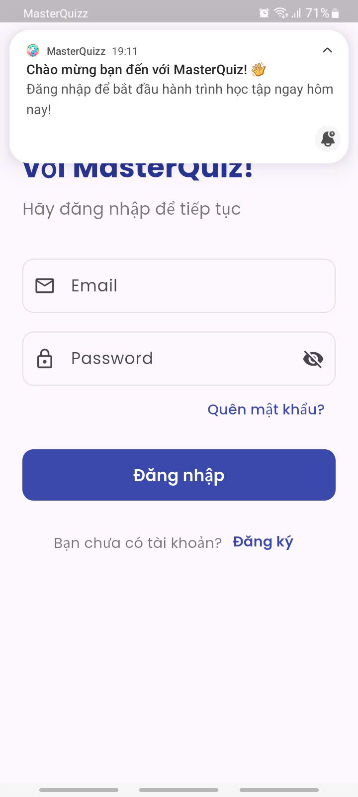
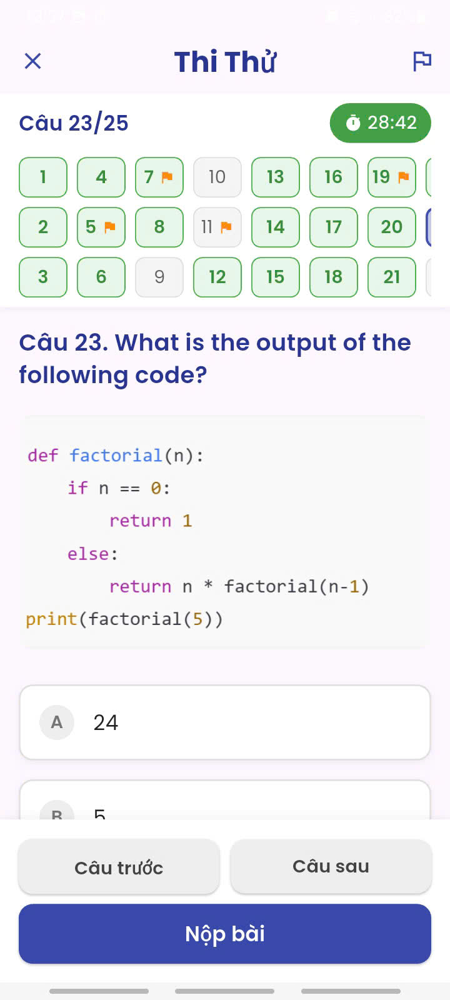

# ✨ My Quiz App

**Ôn tập quiz** là ứng dụng giúp bạn ôn tập câu hỏi trắc nghiệm một cách hiệu quả. Học tập mọi lúc, kiểm tra kiến thức dễ dàng, theo dõi tiến trình của bạn ngay trong ứng dụng!

## Star ⭐ the repo if you like what you see 😉.

## :paintbrush: Thiết kế giao diện

[Xem link thiết kế tại đây](https://www.figma.com/design/mBJAcoPRRvZR9gk1mZ8jt5/Thi%E1%BA%BFt-b%E1%BB%8B-di-%C4%91%E1%BB%99ng?node-id=0-1&p=f&t=eaflydGQ5UxM5Mn7-0)

## 🌟 Features
- User: Đăng ký, đăng nhập, quên mật khẩu, lưu trạng thái đăng nhập.
- Quản lý môn học và ôn tập: Hiển thị danh sách môn học, tìm kiếm môn học, lưu lịch sử tìm kiếm, làm bài tập (giới hạn 60 giây/câu), kiểm tra đáp án, hiển thị điểm số.
- Thi thử: Giao diện riêng cho bài thi, câu hỏi ngẫu nhiên, thời gian giới hạn, tính điểm, hiển thị kết quả.
- Theo dõi tiến độ: Theo dõi số câu đã làm, tỷ lệ trả lời đúng, thời gian ôn tập, lịch sử làm
bài (xem chi tiết, làm lại nếu chưa đạt).
- Cá nhân hóa: Chuyển chế độ sáng/tối, thay đổi mật khẩu, đăng xuất

## 📸 Screenshots

|  | !
[Screenshot 2](assets/screenshots/h1.jpg) | !
[Screenshot 3](assets/screenshots/h3.jpg) |
|---|---|---|---|
|  | !
[Screenshot 5](assets/screenshots/h5.jpg) | !
[Screenshot 6](assets/screenshots/h6.jpg) |
|  | !
[Screenshot 8](assets/screenshots/h7.jpg) | !
[Screenshot 9](assets/screenshots/h8.jpg) |
|  | !
[Screenshot 8](assets/screenshots/h9.1.jpg) | !
[Screenshot 9](assets/screenshots/h10.jpg) |

## 🛠️ Công nghệ sử dụng

- Ngôn ngữ lập trình: Flutter/Dart
- Frontend: Material Design 3, Google Fonts
- Backend: SQLite, DatabaseHelper
- Quản lý trạng thái: Provider, ChangeNotifier, SharedPreferences
- Bảo mật: SHA-256 với salt, FlutterSecureStorage
- Công cụ: Visual Studio Code, Android Studio

## 🚀 Getting Started

### Flutter App Setup

1. Clone the repository

```bash
git clone https://github.com/LeiThanhTu/MobileProject.git
cd MobileProject
```

2. Install dependencies

```bash
flutter pub get
```

3. Run the app

```bash
flutter run
```
## 🤝 Contributing
Contributions are welcome! Please feel free to submit a Pull Request.

Made with ❤️